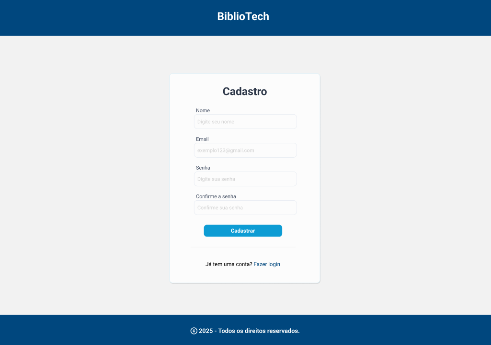
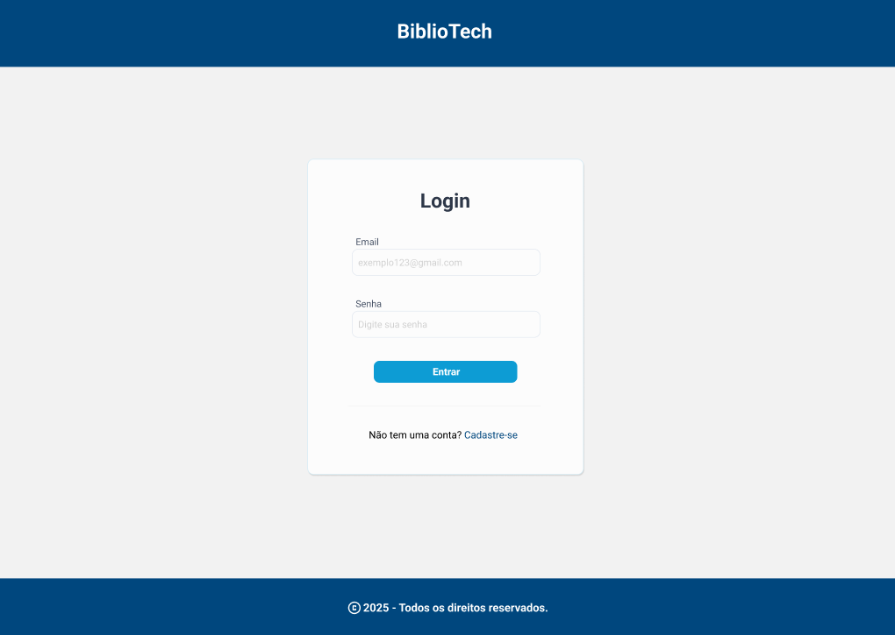
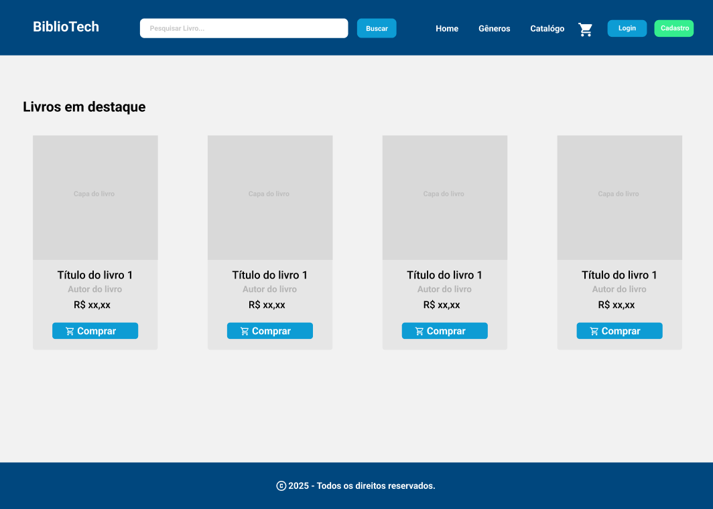
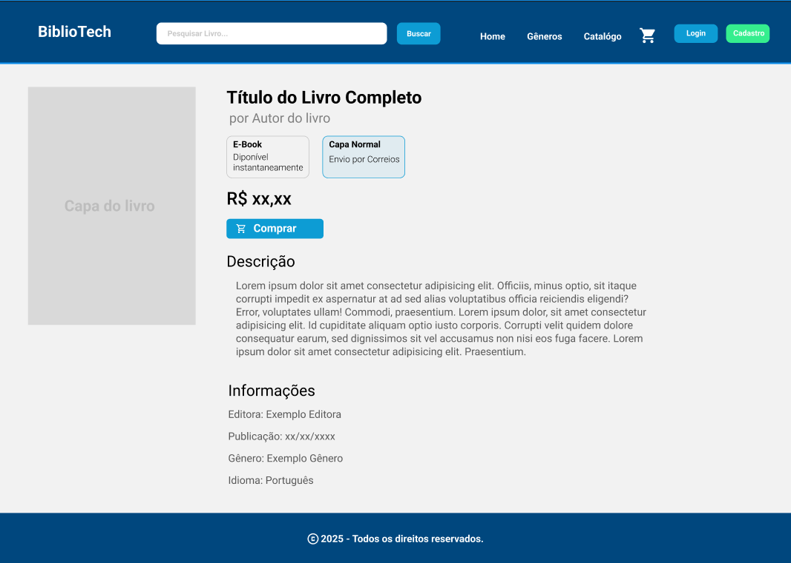
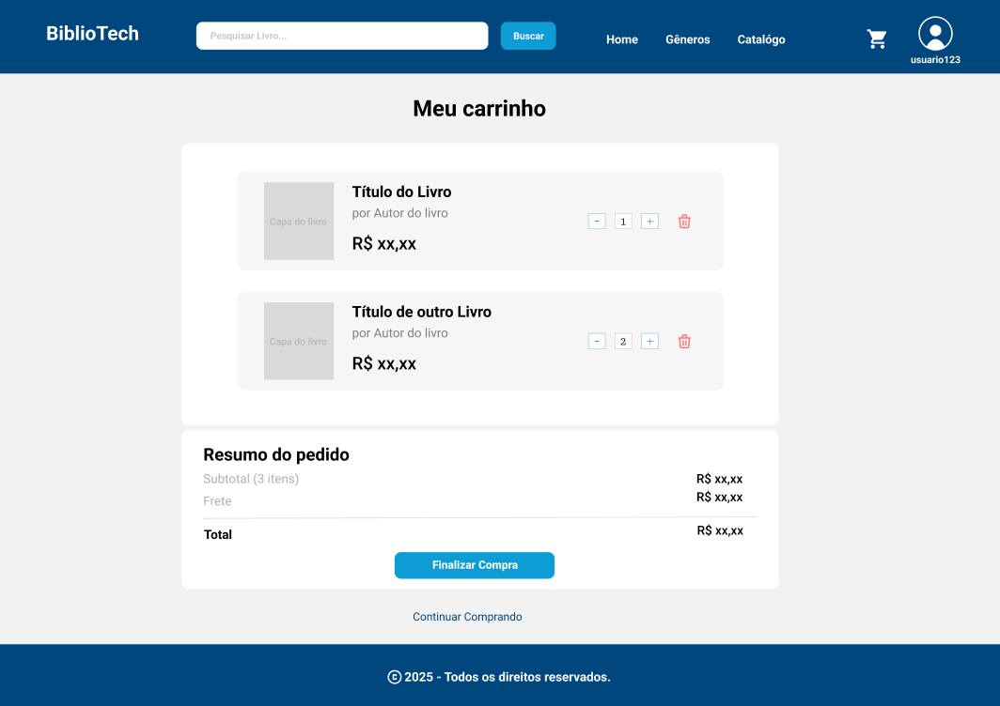
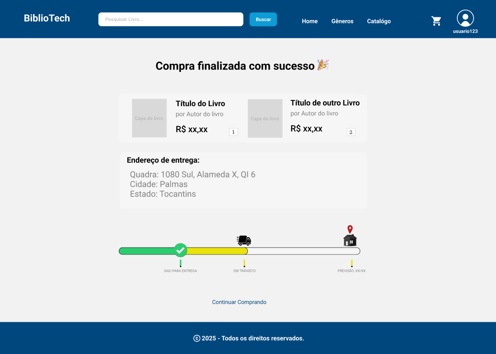
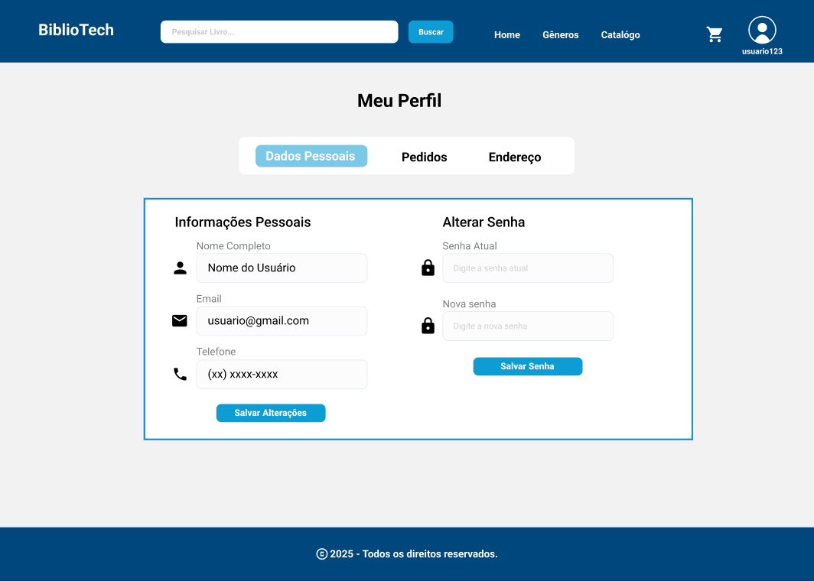
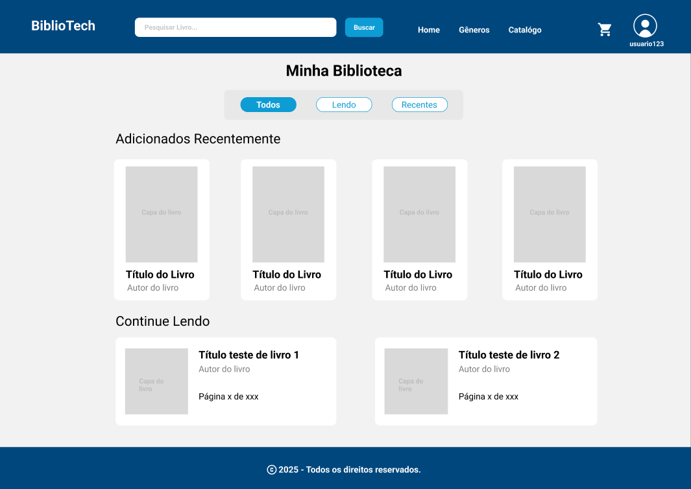
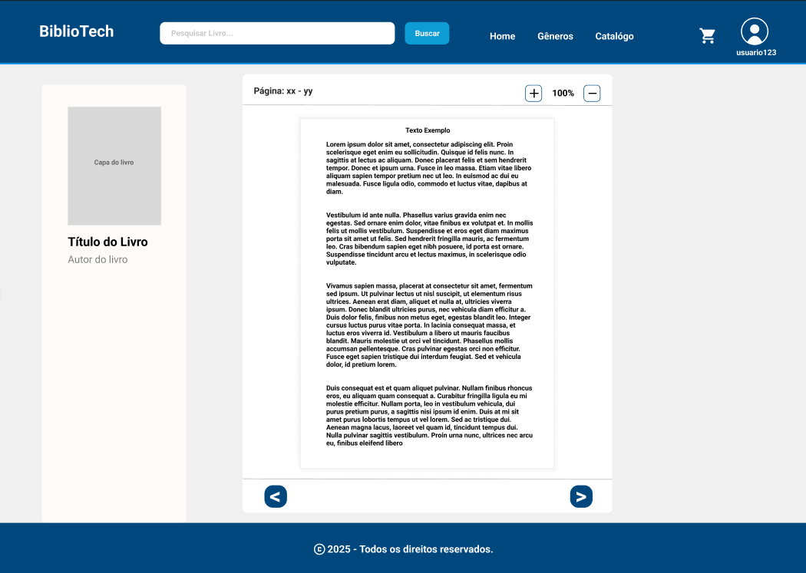
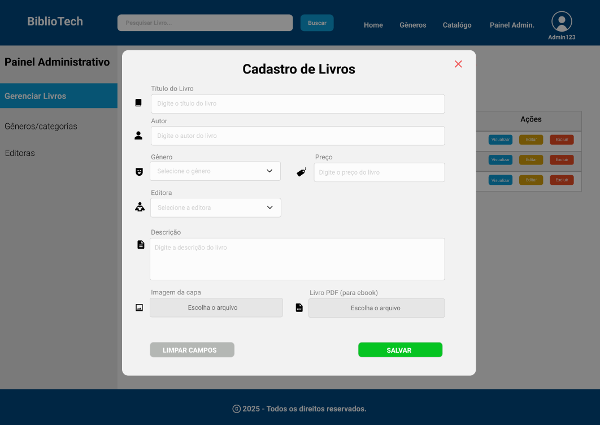

# BiblioTech - Livraria Digital

## Universidade Federal do Tocantins (UFT)

**Curso:** Ciência da Computação  
**Disciplina:** Engenharia de Software  
**Semestre:** 1º Semestre de 2025  
**Professor:** Edeilson Milhomem

## 👥 Integrantes do Time

- Guilherme Thomaz Brito
- Ítalo Henrik Batista Reis
- Jhennifer da Silva Azevedo
- Luiz Felipe da Paz Leal
- Marcos Freire de Melo

## 📌 Navegação

- [📚 Requisitos Funcionais](#requisitos-funcionais)
- [🎭 User Stories](#user-stories)
- [🔁 Iterações](#iterações)

## 📖 Sobre o Projeto

O **BiblioTech** é uma livraria digital que permite a venda de livros digitais (ebooks) de forma acessível e organizada. Os usuários poderão explorar um catálogo de livros, realizar compras e acessar sua biblioteca digital para leitura dos ebooks adquiridos.

## Requisitos Funcionais 

### RF01: Cadastro do Usuário

- O sistema deve permitir que novos usuários se cadastrem.

### RF02: Login do Usuário

- O sistema deve permitir que usuários já cadastrados façam login.

### RF03: Navegação no Catálogo

- O sistema deve exibir um catálogo de livros disponíveis para compra.
- O sistema deve permitir a navegação por categorias e subcategorias de livros.
- O sistema deve exibir livros em destaque.

### RF04: Busca e Filtragem

- O sistema deve permitir a busca de livros por título.
- O sistema deve permitir a busca de livros por gênero literário.
- O sistema deve permitir a busca de livros por palavras-chave e conteúdo.
- O sistema deve permitir a filtragem de resultados por preço.

### RF05: Visualização de Detalhes do Livro

- O sistema deve exibir informações detalhadas sobre cada livro.
- O sistema deve mostrar a capa, sinopse, informações do autor e editora.

### RF06: Carrinho de Compras

- O sistema deve permitir que usuários adicionem livros ao carrinho de compras.
- O sistema deve permitir que usuários removam livros do carrinho.
- O sistema deve permitir que usuários alterem a quantidade de itens.
- O sistema deve salvar o carrinho para acesso posterior, mesmo após logout.
- O sistema deve calcular automaticamente o valor total da compra.

### RF07: Finalização do pedido

- O sistema deve adicionar automaticamente os livros comprados à biblioteca do usuário.
- O sistema deve permitir que o usuário visualize o status e detalhes de seus pedidos anteriores.
- O sistema deve armazenar o histórico de compras do usuário.

### RF08: Gerenciamento de Perfil

- O sistema deve permitir que usuários visualizem seus dados de perfil.
- O sistema deve permitir que usuários editem suas informações pessoais.
- O sistema deve permitir que usuários alterem suas senhas.

### RF09: Biblioteca do Usuário

- O sistema deve exibir todos os livros adquiridos pelo usuário.
- O sistema deve permitir a ordenação dos livros por data de compra, título ou autor.
- O sistema deve permitir a busca de livros na biblioteca do usuário.
- O sistema deve permitir a filtragem de livros por categoria ou status de leitura.

### RF010: Leitor de eBooks

- O sistema deve fornecer um leitor de ebooks integrado.
- O sistema deve permitir a navegação entre capítulos e páginas.
- O sistema deve permitir retornar à última página lida.

### RF11: Gerenciamento de Catalógo

- O sistema deve permitir que administradores adicionem novos livros ao catálogo.
- O sistema deve permitir que administradores editem informações de livros existentes.
- O sistema deve permitir que administradores removam livros do catálogo.
- O sistema deve permitir que administradores categorizem livros em gêneros e coleções.

## User Stories

#### **RF01: Cadastro do Usuário**

**Eu, como usuário, desejo me cadastrar na plataforma BiblioTech.**  
Para isso, eu devo acessar a página inicial e clicar na opção de **Cadastrar**. Para completar o cadastro, preciso inserir informações como **nome , e-mail, senha e confirmação da senha**. Caso eu já tenha uma conta, posso clicar na opção **"Faça login"** e ser direcionado para a tela de login.

---

#### **RF02: Login do Usuário**

**Eu, como usuário, desejo acessar minha conta na BiblioTech.**  
Para isso, preciso estar previamente cadastrado. Na tela de login, devo inserir meu **e-mail e senha cadastrados**. Caso eu não tenha uma conta, posso clicar na opção **"Cadastre-se"** e ser direcionado para a tela de cadastro.

---

#### **RF03: Navegação no Catálogo**

**Eu, como usuário, desejo visualizar os livros disponíveis na BiblioTech, para escolher que livro desejo ver detalhes ou comprar.**  
Para isso, ao acessar a **página inicial**, devo encontrar uma **lista de livros exibidos de forma organizada**, incluindo **livros em destaque, lançamentos**.

---

#### **RF04: Busca e Filtragem**

**Eu, como usuário, desejo buscar livros específicos na plataforma.**  
Para isso, devo poder utilizar a **barra de pesquisa**, onde poderei inserir o **título do livro ou palavras-chave**.

**Eu, como usuário, desejo filtrar os livros exibidos.**  
Para isso, a plataforma deve disponibilizar filtros por **gênero literário, preço**, facilitando a busca pelos livros do meu interesse.

---

#### **RF05: Visualização de Detalhes do Livro**

**Eu, como usuário, desejo visualizar detalhes de um livro antes de comprá-lo.**  
Ao clicar em um livro no catálogo, devo ser direcionado para uma página que contém **a capa do livro, título, autor, sinopse, editora e preço**.

---

#### RF06: Carrinho de Compras

**Eu, como usuário, desejo adicionar livros ao meu carrinho de compras.**
Assim, poderei **selecionar os livros** que desejo comprar e finalizá-los todos juntos no momento apropriado.

**Eu, como usuário, desejo remover livros do meu carrinho.**
Para isso, poderei **acessar o carrinho** e excluir os livros que não quero mais comprar.

**Eu, como usuário, desejo alterar a quantidade de livros no meu carrinho.**
Para isso, poderei ajustar a **quantidade desejada** antes de finalizar a compra (no caso de livros com múltiplos volumes ou coleções).

**Eu, como usuário, desejo que o sistema salve meu carrinho mesmo que eu saia da conta.**
Assim, ao retornar para o sistema, poderei **continuar minhas compras** de onde parei.

**Eu, como usuário, desejo visualizar o valor total da compra no carrinho.**
Para isso, o sistema deve calcular e exibir o **valor atualizado** conforme modifico o conteúdo do carrinho.

---

#### RF07: Finalização do Pedido

**Eu, como usuário, desejo visualizar uma confirmação clara após finalizar minha compra.**
Para isso, o sistema deve exibir uma tela com a mensagem **“Compra finalizada com sucesso 🎉”**, listando os livros adquiridos, suas quantidades, e seus respectivos preços.

**Eu, como usuário, desejo visualizar o endereço de entrega cadastrado para a compra.**
Assim, posso confirmar que os dados estão corretos. O sistema deve exibir o endereço completo com **quadra, alameda, QI, cidade e estado**.

**Eu, como usuário, desejo acompanhar o status da entrega dos meus livros físicos (quando aplicável).**
Para isso, a tela de finalização deve mostrar um indicador visual de rastreio.

---

#### RF08: Gerenciamento de Perfil

**Eu, como usuário, desejo visualizar meus dados pessoais cadastrados.**
Assim, poderei conferir minhas informações diretamente na plataforma.

**Eu, como usuário, desejo editar minhas informações pessoais.**
Para isso, devo conseguir atualizar dados como nome, e-mail ou outras preferências.

**Eu, como usuário, desejo alterar minha senha.**
Para isso, a plataforma deve disponibilizar uma opção segura para redefinir ou atualizar minha senha.

---

#### RF09: Biblioteca do Usuário

**Eu, como usuário, desejo visualizar todos os livros que comprei.**
Assim, poderei acessá-los a qualquer momento em minha biblioteca digital.

**Eu, como usuário, desejo buscar livros específicos dentro da minha biblioteca.**
Para isso, uma barra de pesquisa deve estar **disponível** na tela da biblioteca.

**Eu, como usuário, desejo filtrar os livros da minha biblioteca por categoria.**
Assim, consigo localizar com facilidade os **livros que ainda não li** ou que fazem parte de um gênero específico.

---

#### RF10: Leitor de eBooks

**Eu, como usuário, desejo ler meus livros digitais diretamente na plataforma.**
Para isso, o sistema deve disponibilizar um **leitor de ebooks** integrado, acessível a partir da biblioteca.

---

#### RF11: Gerenciamento de Catálogo (Administrador)

**Eu, como administrador, desejo adicionar novos livros ao catálogo.**
Assim, posso manter a livraria sempre **atualizada** com novos títulos.

**Eu, como administrador, desejo editar as informações dos livros já cadastrados.**
Para isso, devo acessar a área de gerenciamento e **alterar** os dados necessários, como título, sinopse ou preço.

**Eu, como administrador, desejo remover livros do catálogo.**
Assim, consigo **excluir** conteúdos desatualizados ou que não devem mais ser vendidos.

## Iterações
---

### Iteração 1 - Cadastro e Visualização de livros

_Valor_: Permitir que o administrador gerencie os livros disponíveis na livraria digital, incluindo cadastro, edição e remoção de títulos, enquanto o usuário pode visualizar o catálogo de livros, com opções de busca e filtragem

_Objetivo_: Como administrador, desejo acessar o sistema para cadastrar, editar e remover livros do catálogo, de forma organizada, para que os usuários tenham acesso aos títulos corretos.

_Requisitos_:

- RF02 – Login do Usuário
- RF11 – Gerenciamento de Catálogo

_Objetivo_: Como usuário, desejo visualizar os livros disponíveis na plataforma, podendo buscar por título, filtrar por gênero ou preço, para encontrar facilmente os livros do meu interesse.

_Requisitos_:

- RF03 – Navegação no Catálogo

- RF04 – Busca e Filtragem

[Acesse o relatório](relatorios/iteracao-1.md)

---

### Iteração 2 - Autenticação do usuário e Carrinho de Compras.

_Valor_: Garantir que os usuários possam se cadastrar, fazer login, visualizar detalhes dos livros, adicionar ao carrinho, e salvar o carrinho após o logout.

_Objetivo_: Permitir que o usuário se cadastre e faça login na plataforma, visualize os detalhes dos livros, adicione livros ao carrinho e, ao dar logout, o carrinho seja salvo para que possa continuar a compra posteriormente.

_Requisitos_:

- RF01 - Cadastro do Usuário
- RF05 - Visualização de Detalhes do Livro
- RF06 - Carrinho de Compras

[Acesse o relatório](relatorios/iteracao-2.md)

---
